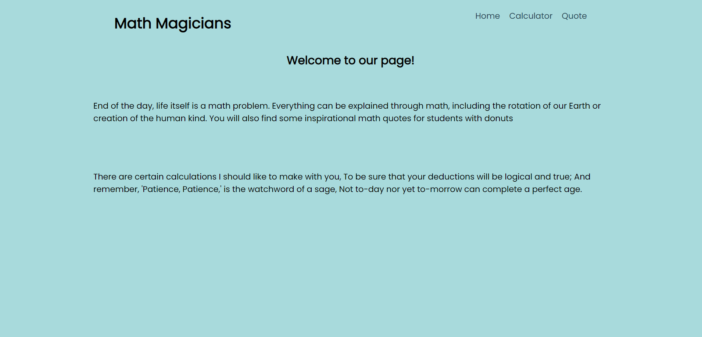

# Math Magicians

> Math Magicians is a website for performing basic maths calculations, This website is built using REACT and JavaScript libraries.

## Screenshots:

Project's features are added into seperate branch to keep main branch safe.

## Built With

- HTML
- CSS
- JavaScript
- Webpack
- REACT

## Online live link

[Visit project online](https://thecodechaser.github.io/math-magicians/dist/)

## Getting Started

To get a local copy up and running follow these simple example steps.

### Prerequisites
- A text editor(preferably Visual Studio Code)

### Install
- [Git](https://git-scm.com/downloads)
- [Node](https://nodejs.org/en/download/)

### Using it Locally
- Clone the project from GitHub `git@github.com:thecodechaser/math-magicians.git`
- Run the following commands as listed in your terminal:
- `npm install`
- `npm run start # this will make webpack watching for your changes in code`

## Visit And Open Files

[Visit Repo](https://github.com/thecodechaser/math-magicians)

## Download Repo

[Download Repo](https://github.com/thecodechaser/math-magicians/archive/refs/heads/main.zip)

## Authors

👤 **Ranjeet Singh**

- GitHub: [@githubhandle](https://github.com/thecodechaser)
- Twitter: [@twitterhandle](https://twitter.com/thecodechaser)
- LinkedIn: [LinkedIn](https://linkedin.com/in/thecodechaser)

## 🤝 Contributing

Contributions, issues, and feature requests are welcome!

Feel free to check the [issues page](https://github.com/thecodechaser/math-magicians/issues).

## Show your support

Give a ⭐️ if you like this project!

## Acknowledgments

- Inspiration: Microverse

## 📝 License

This project is [MIT](./MIT.md) licensed.
